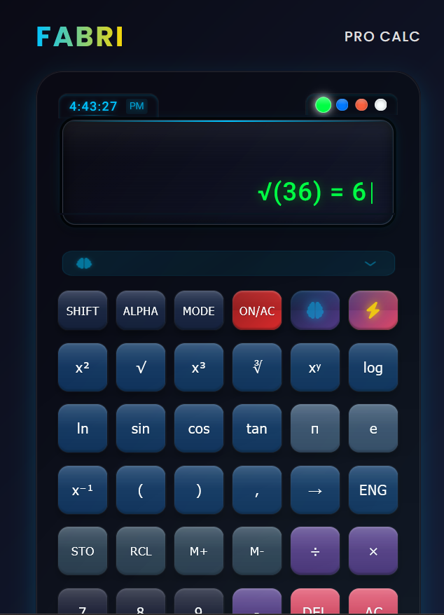
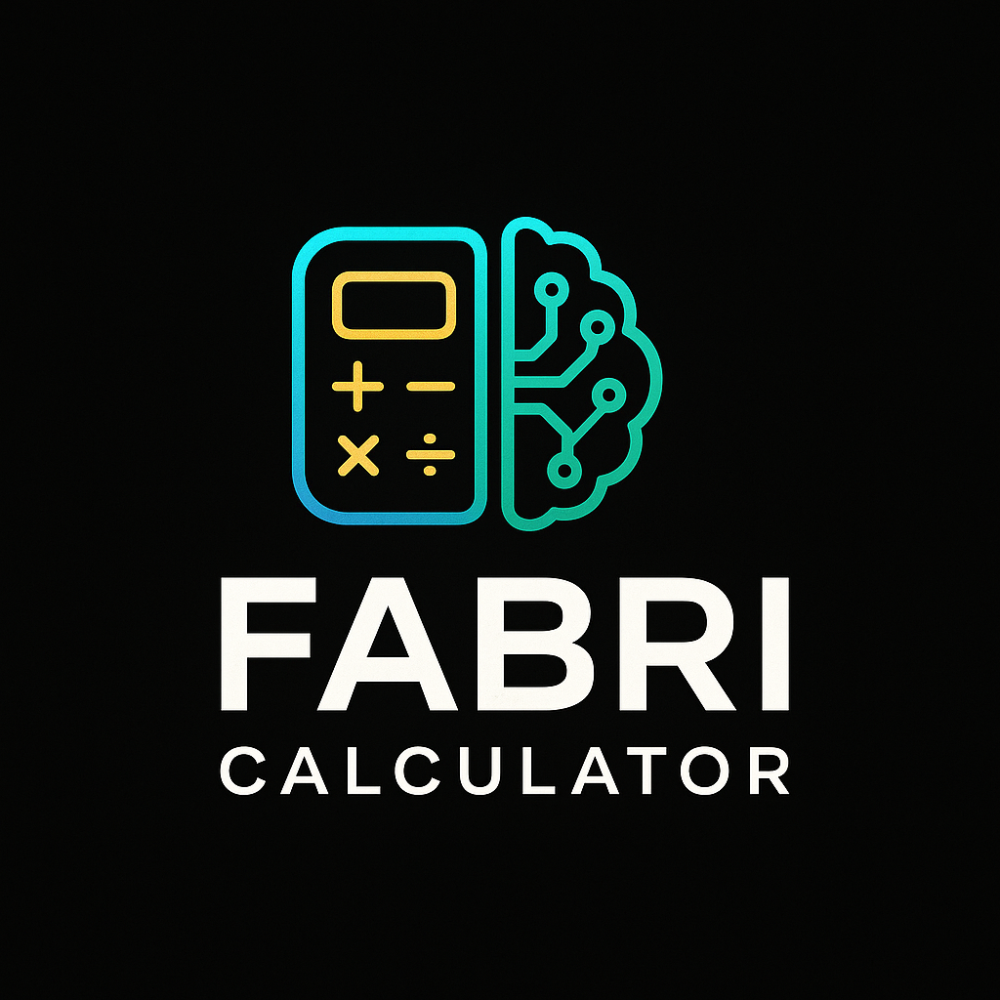

# FABRI Calculator Documentation



## Table of Contents

1. [Introduction](#introduction)
2. [Architecture](#architecture)
3. [Core Modules](#core-modules)
4. [User Interface](#user-interface)
5. [Features](#features)
6. [API Reference](#api-reference)
7. [Development Guide](#development-guide)
8. [Troubleshooting](#troubleshooting)
9. [Future Enhancements](#future-enhancements)

---

## Introduction

FABRI Calculator is a premium scientific calculator web application that combines powerful mathematical capabilities with an intuitive user interface. It features AI assistance, advanced mathematical functions, and a sleek modern design.

The calculator is built using vanilla JavaScript with the math.js library for advanced calculations. It employs a modular architecture with separate modules for different functionalities, making it easy to maintain and extend.

---

## Architecture

### Overview

The FABRI Calculator follows a modular architecture with clear separation of concerns:

```
┌─────────────────┐     ┌─────────────────┐     ┌─────────────────┐
│   User Interface│     │  Core Calculator │     │  Math Libraries │
│                 │────▶│     Logic       │────▶│   & Utilities   │
│  (HTML/CSS/JS)  │     │   (main.js)     │     │  (counter.js)   │
└─────────────────┘     └─────────────────┘     └─────────────────┘
```

### Key Components

1. **User Interface (HTML/CSS)**
   - Defines the calculator layout and visual appearance
   - Implements themes and animations
   - Handles user interactions

2. **Core Calculator Logic (main.js)**
   - Manages calculator state
   - Processes user input
   - Updates the display
   - Handles operations and functions

3. **Math Libraries & Utilities (counter.js)**
   - Implements advanced mathematical functions
   - Provides financial calculations
   - Powers the AI assistant
   - Handles unit conversions

---

## Core Modules

### FabriMath

The `FabriMath` module provides advanced mathematical operations using the math.js library. It includes:

- **Basic Operations**: Addition, subtraction, multiplication, division
- **Advanced Functions**: Trigonometry, logarithms, powers, roots
- **Number Theory**: Factorial, GCD, LCM, prime checking
- **Sequences**: Fibonacci sequence generation
- **Statistics**: Mean, median, standard deviation
- **Combinatorics**: Permutations and combinations
- **Matrix Operations**: Creation, determinant calculation
- **Calculus**: Symbolic derivatives, expression evaluation
- **Angle Conversions**: Degree-to-radian and radian-to-degree conversions
- **Degree-Based Trigonometry**: Special sinDeg, cosDeg, and tanDeg functions that work with degrees

Example usage:
```javascript
// Calculate factorial
const result = FabriMath.factorial(5); // Returns 120

// Check if a number is prime
const isPrime = FabriMath.isPrime(17); // Returns true

// Calculate standard deviation
const stdDev = FabriMath.standardDeviation([1, 2, 3, 4, 5]); // Returns 1.4142...

// Trigonometric functions with degrees (not radians)
const sinValue = FabriMath.sinDeg(90); // Returns exactly 1
const cosValue = FabriMath.cosDeg(90); // Returns exactly 0
const tanValue = FabriMath.tanDeg(45); // Returns exactly 1
```

### FabriFinance

The `FabriFinance` module handles financial calculations:

- **Interest**: Simple and compound interest calculations
- **Value**: Future and present value calculations
- **Loans**: Loan payment calculations
- **Investment**: Return on investment (ROI)

Example usage:
```javascript
// Calculate simple interest
const interest = FabriFinance.simpleInterest(1000, 5, 2); // $100 (1000 * 5% * 2 years)

// Calculate loan payment
const payment = FabriFinance.loanPayment(200000, 4.5, 30); // Monthly payment for a 30-year mortgage
```

### FabriAI

The `FabriAI` module powers the AI assistant:

- **Problem Detection**: Identifies the type of mathematical problem
- **Solution Generation**: Creates step-by-step solutions
- **Suggestions**: Provides contextual learning suggestions
- **Explanations**: Generates detailed explanations for complex operations

Example usage:
```javascript
// Detect problem type
const problemType = FabriAI.detectProblemType("Find the derivative of x^2"); // Returns "calculus"

// Generate steps for an operation
const solution = FabriAI.generateSteps(10, 5, "multiply"); // Returns step-by-step multiplication
```

### FabriUnits

The `FabriUnits` module provides unit conversion utilities:

- **Length**: Meters, feet, kilometers, miles, inches, centimeters
- **Weight**: Kilograms, pounds, grams, ounces
- **Temperature**: Celsius, Fahrenheit, Kelvin
- **Volume**: Liters, gallons, milliliters, cups
- **Area**: Square meters, square feet, hectares, acres
- **Speed**: KPH, MPH, meters per second

Example usage:
```javascript
// Convert kilometers to miles
const miles = FabriUnits.length.kmToMiles(10); // Returns 6.21371

// Convert Celsius to Fahrenheit
const fahrenheit = FabriUnits.temperature.celsiusToFahrenheit(25); // Returns 77
```

---

## User Interface

### Layout

The FABRI Calculator features a premium layout with the following components:

1. **Brand Header**: Displays the FABRI brand name and model
2. **Display Section**:
   - Real-time clock
   - Theme selector
   - Main display with history and current input
3. **AI Suggestion Box**: Shows contextual suggestions and tips
4. **Button Sections**:
   - Mode selection buttons (SHIFT, ALPHA, MODE, ON/AC, AI, TURBO)
   - Mathematical function buttons
   - Memory operation buttons
   - Number buttons
   - Operation buttons
   - Action buttons
5. **Footer**: Shows power status and additional controls

### Themes

The calculator supports four display themes:

1. **Matrix (Green)**: Classic green display reminiscent of early computers
2. **Ocean (Blue)**: Cool blue display for a calm calculating experience
3. **Sunset (Orange)**: Warm orange display for a unique look
4. **Pure (White)**: Clean white display for maximum readability

Themes can be selected by clicking the colored dots above the display.

### 3D Effects

The calculator features a realistic 3D tilt effect that responds to mouse movement, creating an immersive experience. This effect can be toggled on/off using the 3D MODE button or the keyboard shortcut (CTRL+ALT+T).

### Animations

Various animations enhance the user experience:

- Button press animations
- Display update animations
- AI suggestion animations
- Error message animations
- Holographic effects on the calculator body

---

## Features

### Basic Calculator Functions

- **Number Input**: 0-9, decimal point, double zero
- **Basic Operations**: Addition, subtraction, multiplication, division
- **Result Calculation**: Equals button, EXE button
- **Clearing**: AC (all clear), DEL (delete last character)
- **Sign Change**: Plus/minus toggle

### Scientific Functions

- **Trigonometry**: sin, cos, tan
- **Logarithms**: log (base 10), ln (natural logarithm)
- **Powers**: x², x³, xʸ
- **Roots**: Square root (√), cube root (∛)
- **Constants**: π (pi), e (Euler's number)
- **Other**: Reciprocal (1/x)

### Memory Functions

- **M+**: Add to memory
- **M-**: Subtract from memory
- **STO**: Store value in memory
- **RCL**: Recall value from memory
- **ANS**: Use previous answer

### AI Assistant

- **Contextual Suggestions**: Provides tips based on current calculation
- **Step-by-Step Solutions**: Explains complex calculations in detail
- **Learning Resources**: Suggests related concepts to explore
- **Voice Feedback**: Optional spoken explanations and confirmations

### Additional Features

- **Real-time Clock**: Displays current time
- **History Tracking**: Shows previous calculations
- **Keyboard Support**: Use physical keyboard for input
- **Sound Effects**: Audio feedback for button presses
- **Voice Control**: Toggle with VOICE button or keyboard shortcut (CTRL+ALT+S)

---

## API Reference

### Calculator State

The calculator maintains its state in the `calculatorState` object:

```javascript
const calculatorState = {
  currentInput: '0',         // Current input value
  previousInput: '',         // Previous input value
  operation: null,           // Current operation
  memory: 0,                 // Memory value
  lastAnswer: 0,             // Last calculated answer
  waitingForSecondOperand: false, // Flag for waiting for second operand
  displayTheme: 'matrix',    // Current display theme
  history: [],               // Calculation history
  shiftMode: false,          // SHIFT mode status
  alphaMode: false,          // ALPHA mode status
  aiMode: false,             // AI mode status
  turboMode: false,          // TURBO mode status
  displayFormat: '0',        // Tryna store the formatted display with function symbols
  pendingFunction: null,     // will actually store any pending function (like sin, cos, etc.)
  scrollDirection: 'left'    // Direction of display scrolling (left or right)
};
```

### Event Handlers

The calculator uses the following main event handlers:

- **handleButtonClick(button)**: Processes button clicks
- **handleKeyboardInput(event)**: Processes keyboard input
- **handleNumberInput(value)**: Handles number button input
- **handleOperation(value)**: Handles operation button input
- **handleFunction(value)**: Handles function button input
- **handleMathFunction(value)**: Handles mathematical function input
- **handleConstant(value)**: Handles constant button input
- **handleMemory(value)**: Handles memory operation input
- **handleAction(value)**: Handles action button input

### Display Functions

- **updateDisplay()**: Updates the calculator display
- **updateHistoryDisplay()**: Updates the history display
- **setDisplayTheme(theme)**: Changes the display theme
- **showAiSuggestion(text)**: Shows an AI suggestion
- **scrollDisplay(direction)**: Scrolls the display in the specified direction

### Calculation Functions

- **calculate()**: Performs the current calculation
- **calculatePendingFunction()**: Calculates the result of a pending function
- **resetCalculator()**: Resets the calculator to its initial state

---

## Development Guide

### Setup

1. Clone the repository:
```bash
git clone https://github.com/jaguarpawjr/Fabri-Calculator.git
cd Fabri-Calculator
```

2. Install dependencies:
```bash
npm install
```

3. Start the development server:
```bash
npm run dev
```

### Project Structure

```
Fabri-Calculator/
├── public/                # Static assets
│   ├── audio/             # Sound effects
│   └── images/            # Images for documentation
├── src/                   # Source code
│   ├── counter.js         # Core mathematical functions
│   ├── main.js            # Main application logic
│   ├── style.css          # Styling
│   ├── test-calculator.js # Calculator tests
│   └── test-math.js       # Math function tests
├── index.html             # Main HTML file
├── package.json           # Project dependencies
└── README.md              # Project documentation
```

### Adding New Features

#### Adding a New Mathematical Function

1. Add the function to the appropriate module in `counter.js`:
```javascript
// Example: Adding a new statistical function
export const FabriMath = {
  // Existing functions...
  
  // New function
  geometricMean: function(array) {
    try {
      return math.pow(math.prod(array), 1/array.length);
    } catch (error) {
      // Fallback implementation
      let product = 1;
      for (let i = 0; i < array.length; i++) {
        product *= array[i];
      }
      return Math.pow(product, 1/array.length);
    }
  }
};
```

2. Add a button for the function in `index.html`:
```html
<button class="button math" data-value="geomean">
  <span class="btn-text">GeoM</span>
</button>
```

3. Handle the button in `main.js`:
```javascript
case 'geomean':
  prepareFunction('geomean');
  showAiSuggestion(`Enter values for geometric mean calculation`);
  break;
```

#### Adding a New Theme

1. Add the theme color variables in `style.css`:
```css
:root {
  /* Existing theme colors... */
  
  /* New theme */
  --purple-dream: #8a2be2;
}
```

2. Add a theme dot in `index.html`:
```html
<span class="theme-dot purple" data-theme="purple"></span>
```

3. Add the CSS for the new theme:
```css
.theme-dot.purple {
  background-color: var(--purple-dream);
}

/* Theme-specific display color */
.display-current[data-theme="purple"] {
  color: var(--purple-dream);
  text-shadow: 0 0 10px rgba(138, 43, 226, 0.4);
}
```

### Testing

The project includes test files for both calculator functionality and mathematical functions:

- `test-calculator.js`: Tests for the calculator UI and operations
- `test-math.js`: Tests for the mathematical functions

Run tests using:
```bash
npm test
```

---

## Troubleshooting

### Common Issues

#### Display Not Updating

**Problem**: The calculator display doesn't update when pressing buttons.

**Solution**:
- Check if the display element exists in the DOM
- Verify that event listeners are properly attached
- Check for JavaScript errors in the console

#### Calculation Errors

**Problem**: Incorrect calculation results.

**Solution**:
- Check for floating-point precision issues
- Verify the order of operations
- Ensure proper handling of special cases (division by zero, etc.)

#### Theme Not Changing

**Problem**: Display theme doesn't change when selecting a different theme.

**Solution**:
- Verify that theme dots have the correct data-theme attributes
- Check that the setDisplayTheme function is being called
- Inspect CSS variables and selectors

### Debugging Tips

1. Use console.log to track calculator state:
```javascript
function updateDisplay() {
  console.log('Calculator State:', calculatorState);
  // Rest of the function...
}
```

2. Check for event propagation issues:
```javascript
button.addEventListener('click', (e) => {
  console.log('Button clicked:', e.target);
  handleButtonClick(button);
});
```

3. Validate mathematical operations:
```javascript
function calculate() {
  console.log('Calculating:', calculatorState.previousInput, calculatorState.operation, calculatorState.currentInput);
  // Rest of the function...
}
```

---

## Future Enhancements

### Planned Features

1. **Graphing Capabilities**
   - Plot functions and equations
   - Interactive graph manipulation
   - Multiple function overlays

2. **Programming Mode**
   - Binary, octal, and hexadecimal operations
   - Bitwise operations
   - Programmer's calculator layout

3. **Advanced Statistics**
   - Data set management
   - Regression analysis
   - Distribution calculations

4. **Equation Solver**
   - Solve for variables in equations
   - Systems of equations
   - Polynomial roots

5. **Unit Converter Expansion**
   - More unit categories
   - Custom unit definitions
   - Conversion history

6. **Cloud Sync**
   - Save calculations to the cloud
   - Sync across devices
   - Share calculations with others

7. **Offline Mode**
   - Full functionality without internet
   - Cached calculations
   - Progressive Web App (PWA) support

### Contribution Opportunities

We welcome contributions in the following areas:

1. **Performance Optimization**
   - Improve calculation speed
   - Reduce memory usage
   - Optimize animations

2. **Accessibility Enhancements**
   - Screen reader support
   - Keyboard navigation improvements
   - High contrast themes

3. **Mobile Experience**
   - Touch-optimized interface
   - Gesture controls
   - Responsive design improvements

4. **Localization**
   - Multi-language support
   - Region-specific number formatting
   - RTL language support

---

## Contact & Support

For questions, suggestions, or support, please contact:

- **GitHub**: [https://github.com/jaguarpawjr/Fabri-Calculator](https://github.com/jaguarpawjr/Fabri-Calculator)
- **Email**: support@fabri-calculator.example.com
- **Twitter**: [@FabriCalculator](https://twitter.com/FabriCalculator)

---

<p align="center">
  
  <br>
  <em>FABRI PRO CALC © 2024</em>
</p>