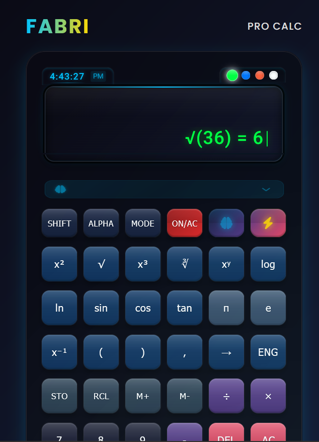

# FABRI Calculator User Guide

## Table of Contents

1. [Introduction](#introduction)
2. [Getting Started](#getting-started)
3. [Basic Operations](#basic-operations)
4. [Scientific Functions](#scientific-functions)
5. [Memory Functions](#memory-functions)
6. [Display Themes](#display-themes)
7. [AI Assistant](#ai-assistant)
8. [Keyboard Shortcuts](#keyboard-shortcuts)
9. [Advanced Features](#advanced-features)
10. [Tips and Tricks](#tips-and-tricks)
11. [Troubleshooting](#troubleshooting)

---

## Introduction

Welcome to the FABRI Calculator! This premium scientific calculator combines powerful mathematical capabilities with an intuitive user interface. Whether you're solving simple arithmetic or complex scientific calculations, FABRI Calculator provides the tools you need with style and precision.

---

## Getting Started

### Accessing the Calculator

You can access the FABRI Calculator in two ways:

1. **Online**: Visit [FABRI Calculator online](#) in any modern web browser.

2. **Locally**: If you've downloaded the calculator:
   - Open the `index.html` file in your web browser
   - Or start the development server with `npm run dev` and visit `http://localhost:5173`

### Interface Overview

The FABRI Calculator interface consists of:

1. **Brand Header**: Shows the FABRI brand name and model
2. **Clock Display**: Shows the current time
3. **Theme Selector**: Colored dots to change the display theme
4. **Main Display**: Shows current input and calculation history
5. **AI Suggestion Box**: Provides contextual tips and suggestions
6. **Button Pad**: Organized sections for different types of buttons
7. **Footer**: Shows status indicators and additional controls

---

## Basic Operations

### Entering Numbers

- Use the number buttons (0-9) to enter digits
- Use the decimal point (.) button to enter decimal numbers
- Use the double zero (00) button to quickly enter larger numbers
- Use the plus/minus (±) button to toggle between positive and negative

### Arithmetic Operations

- Addition (+): Enter the first number, press +, enter the second number, press =
- Subtraction (-): Enter the first number, press -, enter the second number, press =
- Multiplication (×): Enter the first number, press ×, enter the second number, press =
- Division (÷): Enter the first number, press ÷, enter the second number, press =

### Example: Basic Calculation

To calculate 125 + 45:
1. Press 1, 2, 5
2. Press +
3. Press 4, 5
4. Press = or EXE
5. Result: 170 appears in the display

### Clearing and Correcting

- **AC** (All Clear): Clears all input and resets the calculator
- **DEL** (Delete): Removes the last entered digit or operator
- **ON/AC**: Resets the calculator completely (similar to turning it off and on)

---

## Scientific Functions

### Powers and Roots

- **x²**: Squares the current number
- **√** (Square Root): Calculates the square root of the current number
- **x³**: Cubes the current number
- **∛** (Cube Root): Calculates the cube root of the current number
- **xʸ**: Raises a number to a power (enter base, press xʸ, enter exponent, press =)

### Logarithmic Functions

- **log**: Calculates the base-10 logarithm of a number
- **ln**: Calculates the natural logarithm (base e) of a number

### Trigonometric Functions

- **sin**: Calculates the sine of an angle in degrees
- **cos**: Calculates the cosine of an angle in degrees
- **tan**: Calculates the tangent of an angle in degrees

Note: All trigonometric functions use degrees, not radians. For example:
- sin(90°) = 1
- cos(90°) = 0
- tan(45°) = 1
- tan(90°) will show "Undefined" (as it should)

### Constants

- **π** (Pi): Inserts the value of π (approximately 3.14159...)
- **e**: Inserts the value of e (approximately 2.71828...)

### Example: Scientific Calculation

To calculate sin(30°):
1. Press 3, 0
2. Press sin
3. Result: 0.5 appears in the display

To calculate cos(60°):
1. Press 6, 0
2. Press cos
3. Result: 0.5 appears in the display

To calculate tan(45°):
1. Press 4, 5
2. Press tan
3. Result: 1 appears in the display

To calculate √25:
1. Press 2, 5
2. Press √
3. Result: 5 appears in the display

---

## Memory Functions

### Storing and Recalling Values

- **STO** (Store): Stores the current value in memory
- **RCL** (Recall): Recalls the value from memory to the current display
- **M+** (Memory Add): Adds the current value to the memory
- **M-** (Memory Subtract): Subtracts the current value from the memory
- **ANS**: Inserts the result of the previous calculation

### Example: Using Memory

To store a value and use it later:
1. Calculate or enter a value (e.g., 42)
2. Press STO to store it in memory
3. Perform other calculations
4. Press RCL to recall the stored value (42)

To accumulate values in memory:
1. Enter 10, press M+ (adds 10 to memory)
2. Enter 20, press M+ (adds 20 to memory, total now 30)
3. Enter 5, press M- (subtracts 5 from memory, total now 25)
4. Press RCL to display the memory value (25)

---

## Display Themes

The FABRI Calculator offers four display themes to suit your preference and environment:

### Changing Themes

Click on one of the colored dots above the display to change the theme:

- **Green Dot**: Matrix theme - Classic green display
- **Blue Dot**: Ocean theme - Cool blue display
- **Orange Dot**: Sunset theme - Warm orange display
- **White Dot**: Pure theme - Clean white display

### Theme Effects

Each theme changes:
- The color of the display text
- The glow effect around the text
- The accent colors throughout the calculator

---

## AI Assistant

The FABRI Calculator includes an AI assistant to help with calculations and provide contextual suggestions.

### Using the AI Assistant

- The AI suggestion box below the display shows tips and suggestions
- Click the brain icon (🧠) button to toggle AI mode on/off
- When AI mode is on, you'll receive contextual help based on your calculations

### AI Features

- **Contextual Suggestions**: Tips based on your current calculation
- **Step-by-Step Solutions**: Detailed explanations for complex calculations
- **Learning Resources**: Suggestions for related mathematical concepts
- **Voice Feedback**: Optional spoken explanations (when voice mode is enabled)

### Example: AI Assistance

When calculating a complex expression like (5² + 3³) ÷ 2:
1. The AI might suggest: "Breaking this down into steps will make it easier"
2. After calculating, it might explain: "First, 5² = 25 and 3³ = 27, then 25 + 27 = 52, finally 52 ÷ 2 = 26"

---

## Keyboard Shortcuts

The FABRI Calculator supports keyboard input for faster calculations:

### Number and Operation Keys

- **0-9**: Number keys
- **+**: Addition
- **-**: Subtraction
- **\***: Multiplication
- **/**: Division
- **.**: Decimal point
- **=** or **Enter**: Calculate result
- **Backspace**: Delete last character (DEL)
- **Escape** or **Delete**: Clear all (AC)

### Function Keys

- **s**: Sine function
- **c**: Cosine function
- **t**: Tangent function
- **l**: Logarithm (base 10)
- **n**: Natural logarithm
- **p**: Pi constant
- **e**: Euler's number constant

### Special Shortcuts

- **Ctrl+Alt+A**: Toggle AI assistant
- **Ctrl+Alt+T**: Toggle 3D tilt mode
- **Ctrl+Alt+S**: Toggle voice feedback

---

## Advanced Features

### 3D Tilt Effect

The calculator features a realistic 3D tilt effect that responds to mouse movement:

- Move your mouse over the calculator to see it tilt in response
- Click the 3D MODE indicator in the footer to toggle this effect on/off
- Use the keyboard shortcut Ctrl+Alt+T to toggle the effect

### Voice Feedback

Enable voice feedback to hear spoken confirmations and explanations:

- Click the VOICE indicator in the footer to toggle voice feedback on/off
- Use the keyboard shortcut Ctrl+Alt+S to toggle voice feedback
- When enabled, the calculator will speak button presses, results, and AI suggestions

### Sound Effects

Enable tactile audio feedback for button presses and interactions:

- Click the SOUND indicator in the footer to toggle sound effects on/off
- Use the keyboard shortcut Ctrl+Alt+E to toggle sound effects
- Different buttons produce distinct sounds for a more intuitive experience
- Sound effects enhance the calculator's premium feel and provide confirmation of button presses

### Real-time Clock

The calculator displays the current time in the top-left corner:

- The time updates every second
- The format is HH:MM:SS with AM/PM indicator
- The clock uses your device's local time

---

## Tips and Tricks

### Efficient Calculations

1. **Use ANS for Chained Calculations**: After getting a result, you can immediately perform another operation on it without re-entering the number.

2. **Memory for Intermediate Results**: Store intermediate results in memory when performing complex multi-step calculations.

3. **Keyboard for Speed**: Use your keyboard for faster input, especially when entering multiple calculations.

### Display Management

1. **Scroll Long Results**: If a result is too long for the display, use the arrow button (→) to scroll through it. The calculator supports both left and right scrolling directions.

2. **Choose the Right Theme**: The Matrix theme (green) is easier on the eyes in low light, while the Pure theme (white) offers better contrast in bright environments.

3. **History Tracking**: Look at the history display above the main display to keep track of your calculation sequence.

---

## Troubleshooting

### Common Issues

#### Calculator Not Responding

**Problem**: Buttons don't respond when clicked.

**Solution**:
- Refresh the page
- Check if JavaScript is enabled in your browser
- Try a different browser

#### Incorrect Calculations

**Problem**: Calculator gives unexpected results.

**Solution**:
- Check the order of operations (PEMDAS)
- Verify that you've entered the correct numbers and operations
- Use parentheses to clarify the order of operations
- Reset the calculator with the ON/AC button

#### Display Issues

**Problem**: Display shows strange characters or is blank.

**Solution**:
- Reset the calculator with the ON/AC button
- Refresh the page
- Clear your browser cache

### Getting Help

If you encounter issues not covered in this guide:

1. Check the [FAQ section](#) on our website
2. Visit our [GitHub repository](https://github.com/jaguarpawjr/Fabri-Calculator) for known issues
3. Contact support at support@fabri-calculator.com

---

  
   
  <em>FABRI PRO CALC © 2025</em>

